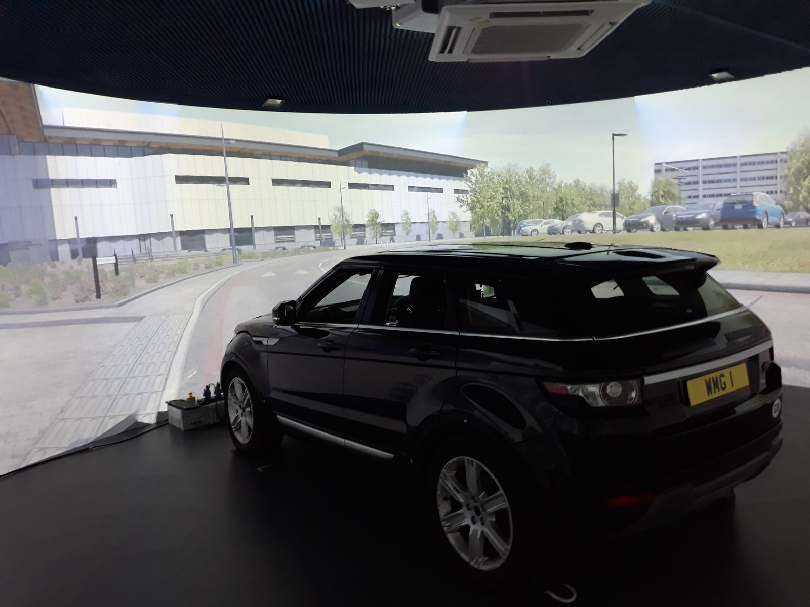
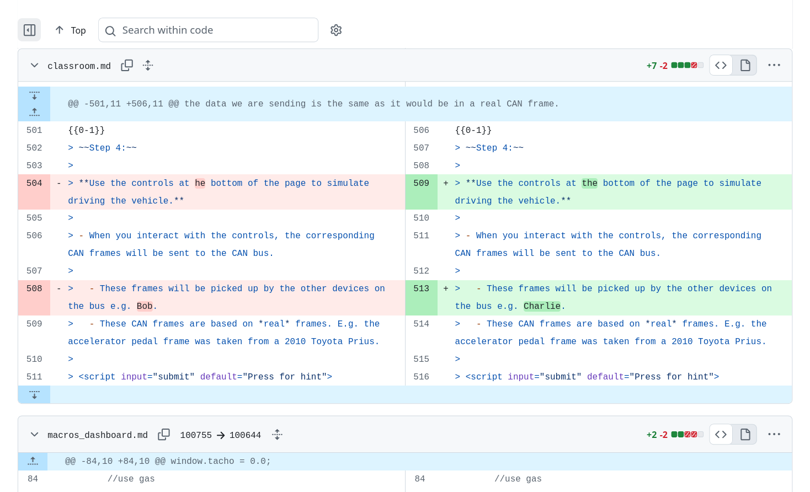
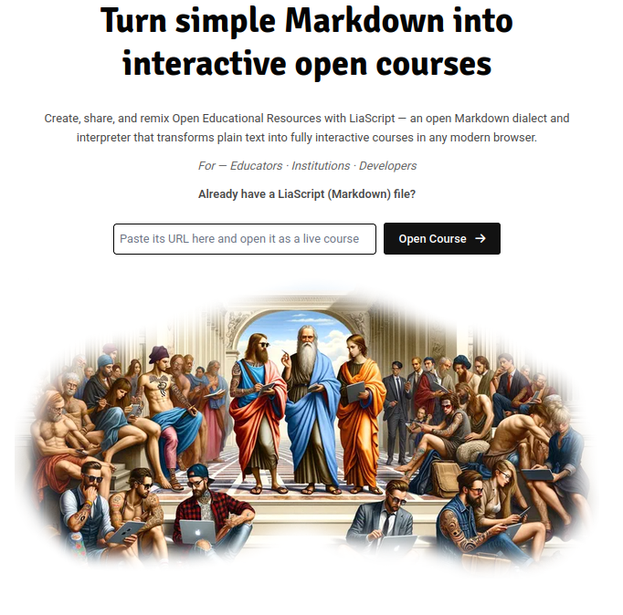
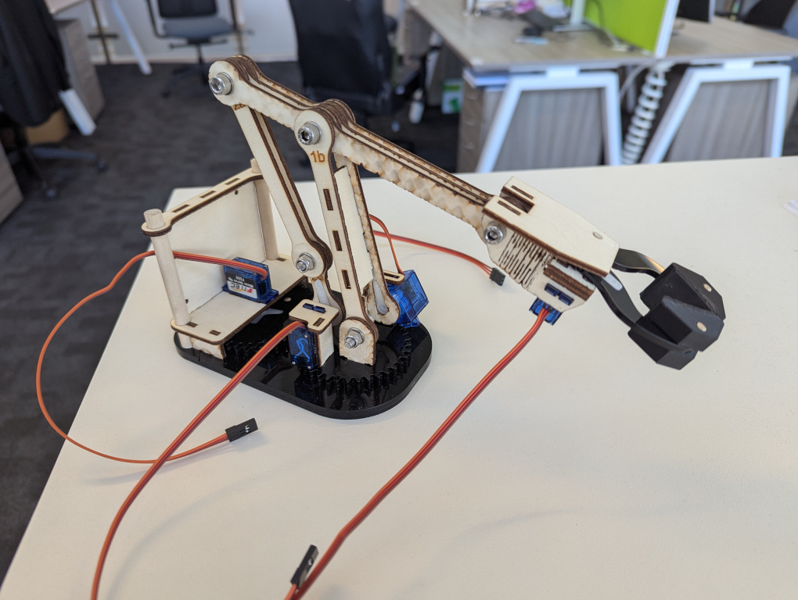
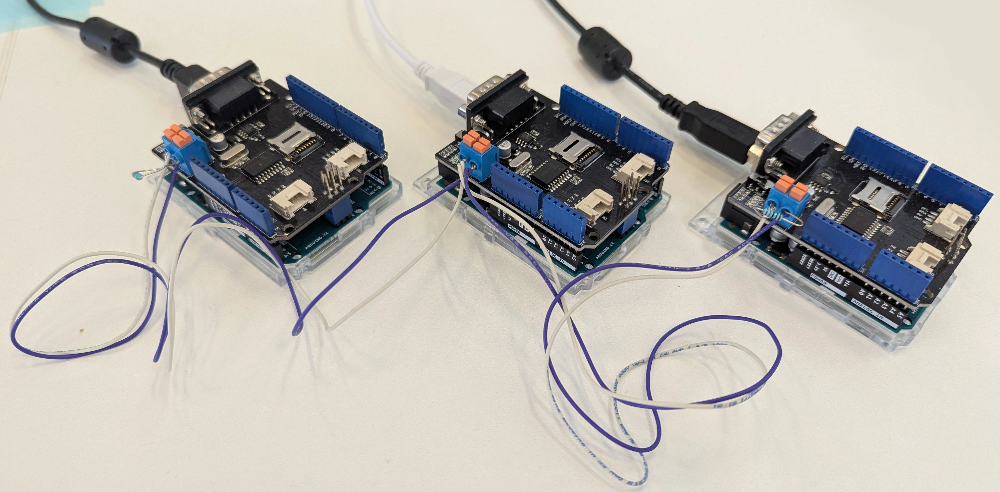

<!--
author:   David Croft
email:    david.croft@warwick.ac.uk
version:  0.2.0
language: en
narrator: UK English Female

classroom: enable
icon: https://dscroft.github.io/liascript_materials/assets/logo.svg

import: https://raw.githubusercontent.com/LiaScript/CodeRunner/master/README.md
import: macros_interface.md
import: macros_dashboard.md
import: sqli_demo.md


link:  styles.css

@style
.lia-effect__circle {
    display: none;
}

.flex-container {
    display: flex;
    flex-wrap: wrap; /* Allows the items to wrap as needed */
    align-items: stretch;
    gap: 20px; /* Adds both horizontal and vertical spacing between items */
}

.flex-child { 
    flex: 1;
    margin-right: 20px; /* Adds space between the columns */
}

@media (max-width: 600px) {
    .flex-child {
        flex: 100%; /* Makes the child divs take up the full width on slim devices */
        margin-right: 0; /* Removes the right margin */
    }
}

#slidetext {
    min-width: 700px;
}
@end

@onload
// frame receiver
LIA.classroom.subscribe("can-frame", (message) => {
    window.can_message_handler(message["id"], message["data"]);
})

// frame sender
window.send_can_frame = function(frameid, data) {
    LIA.classroom.publish("can-frame", {
        id: frameid,
        data: data
    });
}
@end


@Classroom.defaultManager
------------------------

**CAN bus status: ** 
<script>
    function status()
    {
        if (LIA.classroom.connected) {
            send.lia("LIASCRIPT: **Emulated**<!-- style='color: green;' -->");
        } else {
            send.lia("LIASCRIPT: **Disconnected**<!-- style='color: red;' -->");
        }
    }

    setInterval(() => status, 1000);
    status();
</script> 

------------------------

@end
-->

# LiaScript for real and virtual hardware control

*David Croft and Sulakshan Rajendran*

---------------------------------------

This presentation was created in [LiaScript](https://liascript.github.io/).

<section class="flex-container">
<div class="flex-child" id="slidetext">

- Presenting in "Presentation" mode.
- If you want to follow along.
  
  - Just scan the QR to get the URL.
  - Click connect on the Classroom page.

Need someone to or the demo won't work.
</div>
  
<div class="flex-child">
[qr-code](https://liascript.github.io/course/?eyJiYWNrZW5kIjoiTVFUVCIsImNvdXJzZSI6Imh0dHBzOi8vZHNjcm9mdC5naXRodWIuaW8vcGVlMjYvTElBLm1kIiwicm9vbSI6InBlZTI2In0=#1)
</div>
</section>


# WMG

<section class="flex-container">
<div class="flex-child" id="slidetext">
The Intelligent Vehicles (IV) teaching group within Warwick Manufacturing Group (WMG).

- Been delivering the Smart Connected Autonomous Vehicles (SCAV) maters programme.
- Begin offering CPD variant to a top level automotive company. 
  
  - <span>2024</span>.
  - Additional commercially sensitive information.

- Delivered via WMG e-learning platform.
  
  - SCORM files on a secure Moodle.
  - Relied on a commercial suite of software tools. 

Delivery was a success.
</div>
<div class="flex-child">

</div>
</section>

## Maintenance

<section class="flex-container">
<div class="flex-child" id="slidetext">
Course needs regular updates.

- Changes requested by partner organisation.
  - Change management was a problem due to the platform's functionality.
  - Only one person able to work at a time.
  
- Specific major incident.
  - Half the module material lost from the platform.
  - Write only backups meant no delivery impact.
  - But had to recreate everthing.
  
--------------------------------------------------

Commercial suite might be acceptable for an individual.

- Did not work for a team.
- Also expensive, £749 per seat.
</div>
<div class="flex-child">

</div>
</section>


# LiaScript

Looking for alternatives.

- LiaScript is framework for creating interactive learning materials. 
  - Credit to André Dietrich.
- Open-source.
  - Free as in speech.
  - Free as in beer.
- Simple Markdown syntax.
  - For majority of built in functionality.
- Trivially version controllable.


## Markdown based

Markdown is a simple markup language.

- Markup language is something like HTML.
  - Text based system to describe structure and formatting.
- Markdown is an especially lightweight system.

-------------------------------------

          {{0-1}}
************************************

Markdown lets you do things like...

<section class="flex-container">
<div class="flex-child" style="min-width: 250px">
```markdown
**Bold**, 
*italics*, 
~~underline~~ 
and ~strikethrough~.
```
</div>
<div class="flex-child" style="min-width: 250px">
**Bold**, *italics*, ~~underline~~ and ~strikethrough~.
</div>
</section>

************************************

          {{1-2}}
************************************

Or Maths.

- Should be familiar to LaTeX users

<section class="flex-container">
<div class="flex-child" style="min-width: 250px">
```markdown
$$c = \sqrt{a^2 + b^2}$$
```
</div>
<div class="flex-child" style="min-width: 250px">
$$c = \sqrt{a^2 + b^2}$$
</div>
</section>

************************************

          {{2-3}}
************************************

Or Code.

- Syntax highlighting & copy-all.

<section class="flex-container">
<div class="flex-child" style="min-width: 250px">
````markdown
```cpp
float c = sqrt(pow(a,2) + pow(b,2));
```
````
</div>
<div class="flex-child" style="min-width: 250px">
```cpp
float c = sqrt(pow(a,2) + pow(b,2));
```
</div>
</section>

************************************

          {{3-4}}
************************************

Or Tables:

- Sortable.

<section class="flex-container">
<div class="flex-child" style="min-width: 250px">
```markdown
| Col A   | Col B |
| ------- | ----- |
| Alpha   | B1    |
| Beta    | B2    |
| Charlie | B3    |
```
</div>
<div class="flex-child" style="min-width: 250px">
| Col A   | Col B |
| ------- | ----- |
| Alpha   | B1    |
| Beta    | B2    |
| Charlie | B3    |
</div>
</section>

************************************


          {{4-5}}
************************************

Or Images:

```markdown

```


************************************


          {{5-6}}
************************************

Or (in LiaScript) quizzes:

<section class="flex-container">
<div class="flex-child" style="min-width: 700px">
```markdown
**If the answer is 42, what is the question?**

[( )] How many roads must a man walk down?
[(X)] What do you get if you multiply six by nine?
[( )] How many towels should you bring?
*********************************************
According to Douglas Adams at least.
*********************************************
```
</div>
<div class="flex-child" style="min-width: 200px">
**If the answer is 42, what is the question?**

[( )] How many roads must a man walk down?
[(X)] What do you get if you multiply six by nine?
[( )] How many towels should you bring?
*********************************************
According to Douglas Adams at least.
*********************************************
</div>
</section>

************************************


          {{6-7}}
************************************

Plus:

<section class="flex-container">
<div class="flex-child">
- Videos.
- Animations.
- Hyperlinks.
- Footnotes.
- Audio.
</div>
<div class="flex-child">
- Lists.
- Charts.
- Ascii art.
- TTS.
- And more.
</div>
</section>

************************************


## Benefits

<section class="flex-container">
<div class="flex-child" style="min-width: 250px">
Because LiaScript is just markdown and therefore a text file.

- Easily version controlled with standard tools.
  - E.g. Git, Mercurial etc.
- Multiple collaborators can work on the same file.
  - Merge versions.
- Changes are tracked.
  - Previous versions can be restored.
  - Very hard to loose work.
</div>
<div class="flex-child" style="min-width: 250px">

</div>
</section>


## Deployment

<section class="flex-container">
<div class="flex-child" id="slidetext">

**Simple option**

- Put the file on Github and point LiaScript site at your file.
- Just append your file URL.

  - [https://liascript.github.io/course/?https://dscroft.github.io/pee26/LIA.md](https://liascript.github.io/course/?https://dscroft.github.io/pee26/LIA.md)

</div>
<div class="flex-child">

</div>
</section>

          {{1}}
************************************

-----------------------------------

Or use LiaScript exporter to output to other formats:

<section class="flex-container">
<div class="flex-child">
- PDF.
- Standalone HTML.
- IMS.
- Android App.
- JSON.
</div>
<div class="flex-child">
- EPUB.
- DOCX.
- RDF.
- xAPI.
- SCORM (i.e. Moodle).

  - Useful for our commercially sensitive modules.
</div>
</section>

************************************


# Usage in WMG

<section class="flex-container">
<div class="flex-child" id="slidetext">

Multiple courses and modules at various levels.

- UG, MSc, DA, CPD, Formula Student AI extracurricular.

- IV team still using the commercial suite for legacy materials.
  - Can't see us developing anything new in that system.
  - Exploring content exfiltration options.
- New/updated materials in LiaScript.  

</div>
<div class="flex-child">

</div>
</section>


## Extensions

Rendered LiaScript page is ultimately just HTML.

- Highly extensible with custom macros to interface with external tools and APIs.

- Worth noting that the base LiaScript functionality covered 99% our initial use case.
  - CPD course migration.
  - A few HTML iframes to import existing drag-and-drop quizzes.


### Programming

For example, the Programming for AI module:

- Makes heavy use of ability to embed runnable code.
  - Coderunner extension.

<section class="flex-container">
<div class="flex-child" style="min-width: 250px">
````markdown
```python
for i in range(5):
  print( f"Hello World! {i}" )
```
@LIA.python()
````
</div>
<div class="flex-child" style="min-width: 250px">
```python
for i in range(5):
  print( f"Hello World! {i}" )
```
@LIA.python()
</div>
</section>


### Cybersecurity

CPD modules to non-technical audiences and SQL intro sessions.

- SQL injection demonstration.
- Uses AlaSQL to run a SQL database in the browser.
  - Based on work by the [DART Team](dart@chop.edu).
- No need for a real database.
  - Multiple students can work at once.

          {{1}}
************************************

------------------------------------

SQL injection demo
===================

<script input="submit" default="Hint">
"LIASCRIPT: Try entering the following as the username, you need to enter it exactly.\n\n*fake' or 1=1; \\-\\-*"
</script>

@LoginExample

************************************


### Arduino interface

Everything discussed so far was based on existing extensions.

- Our first original extension was an Arduino interface.
  - Webserial to Arduino.
- Read sensor data or control actuators directly from our learning materials.
  - Whatever you want to do with an Arduino.
- Point isn't Arduino.
  - Point is controllable/readable hardware from within the teaching materials.

The extension, 
[https://github.com/dscroft/liascript_servo](https://github.com/dscroft/liascript_servo).

- Works.
- Todo - make friendlier.

-----------------------------------

              {{1}}
************************************

<section class="flex-container">
<div class="flex-child" style="min-width: 250px">
Robot arm interface
===================

- Rapid prototyping module.

</div>
<div class="flex-child" style="min-width: 250px">

</div>
</section>

-------------------------------------

************************************


              {{2}}
************************************

<section class="flex-container">
<div class="flex-child" style="min-width: 250px">
CAN bus interface
=================

- Automotive Cybersecurity CPD.

</div>
<div class="flex-child" style="min-width: 250px">

</div>
</section>

-------------------------------------

************************************

# CAN hacking

Setup an actual CAN bus using Arduino boards and send real CAN frames between them.

<section class="flex-container">

<div class="flex-child" style="min-width: 250px;">

- Could use 'real' software.
  - License requirements.
  - IT involvement.
  - Need to teach the software.
- Embedding in LiaScript.
  - Free.
  - No deployment issues.
  - Just does what we need.

</div>

<!-- class="flex-child" style="min-width: 600px;" -->
```ascii
             .-------------------. .-------------------.
+--------+   |      +--------+   | |      +--------+   |
|        |   +-.    |        |   | |      |        |   +-.  
|   CANL o <-+ |    |   CANL o <-.-.      |   CANL o <-+ |
|        |     #    |        |            |        |     #
|        |     #    |        |            |        |     # Resistor
|        |     #    |        |            |        |     #
|   CANH * <-+ |    |   CANH * <-.-.      |   CANH * <-+ |
|USB     |   +-.    |USB     |   | |      |USB     |   +-.
+-#------+   |      +-#------+   | |      +-#------+   |
  |          |        |          | |        |          |
 💻👩        |       💻😈        | |       💻👨        |
             .-------------------. .-------------------.
```  

</section>


## Remote open days

<section class="flex-container">
<div class="flex-child" id="slidetext">

WMG has been running virtual open days.

- Increase accessibility / wider audience, 
- In 2025 SCAV course team decided to up our game.
  - Not just the usual virtual lecture.
  - Interactive lab session.
- CAN hacking looks like a bad fit.
  - But! LiaScript classroom functionality.
  - Quickly adjust existing activity.

</div>
<div class="flex-child">

</div>
</section>

          {{1}}
*****************************************

-------------------------------------------------

Benefits 
========

- Attendee's just need a URL.
  - No accounts, no software installation.
- Collaborative development.
  - Needed to do a fast turn around.

*****************************************

          {{2}}
*****************************************

-------------------------------------------------

The Activity
========

<section class="flex-container">
<div class="flex-child" id="slidetext">

Groups of 2.

- Alice and Charlie.
- Activity takes them through sniffing CAN frames.
  - Then a replay attack, Charlie hacking Alice.
- Same CAN data as with the Arduinos.
  - But sent over the net to the virtual attendees.

</div>
<div class="flex-child">

[qr-code](https://liascript.github.io/course/?https://dscroft.github.io/liascript_can_hacking/classroom.md "The actual session")

</div>
</section>

[https://liascript.github.io/course/?https://dscroft.github.io/liascript_can_hacking/classroom.md](https://liascript.github.io/course/?https://dscroft.github.io/liascript_can_hacking/classroom.md)

*****************************************


### Alice 👩

@Classroom.defaultManager

<section class="flex-container">
<div class="flex-child" style="min-width: 200px; max-width: 50%;">
@can.alice
</div>
<div class="flex-child" style="min-width: 560px;">
@Dashboard.display
</div>
</section>

### Charlie 😈

@Classroom.defaultManager

@can.retransmit


# Conclusions

          {{0-1}}
*****************************************

General LiaScript deployment.
=============================

- Very well received.
- Lots of positive student satisfaction comments.
- Expanding usage.
  - Re-usable library of topics.

--------------------------------------------------

Virtual open day activity 
=========================

- Minimal feedback captured.
  - But What we have is positive.

*****************************************
 
          {{1-2}}
*****************************************

**Could we achieve this without LiaScript?**

- Just need to teach teach all the IV staff web development.
- Develop a custom websites.
- Host our own webserver with account management.

--------------------------------------------

**Substantially easier within LiaScript.**

- If using the 'standard' functionality.
  - Development easy.
  - Deployment trivial.
  
--------------------------------------------

**Creating/customisation of extensions is more difficult.**

- HTML and Javascript knowledge.
- But once created, macro system allows easy reuse.

*****************************************


## Future work

<section class="flex-container">
<div class="flex-child" id="slidetext">
Integrating ROS into LiaScript.

- RobotWebTools/Roslibjs for interaction with ROS.
  - Have used them previously to create web interfaces for robots.
- Control is easy.
- Sensor visualisation is proving tricky.
</div>
<div class="flex-child">

</div>
</section>


# Questions?

Or get in contact:

[david.croft\@warwick.ac.uk](mailto:david.croft@warwick.ac.uk)
